# IBM HR Employee Attrition Dashboard (Excel Project)

```


## Overview
This project analyzes employee attrition using the IBM HR dataset.  
It demonstrates **Excel data cleaning, Power Query Editor (PQE) transformations, PivotTables, charts, dashboards, and slicers** to uncover HR insights.

## Problem Statement

This dashboard helps HR teams understand **employee attrition patterns** across age, overtime, department, job role, education field, and marital status.  
It highlights which groups are most vulnerable, what factors drive attrition, and where retention strategies should be focused.  

Attrition is a critical HR metric: high turnover increases recruitment costs, reduces productivity, and impacts morale.  
By analyzing attrition trends, HR can design **targeted retention programs** for vulnerable groups while leveraging stability in resilient groups.

---

## Project Files
- [IBM_HR_Employee_Attrition_Raw.xlsx](./excel_files/IBM_HR_Employee_Attrition_Raw.xlsx) → Original dataset before cleaning  
- [IBM_HR_Employee_Attrition_Cleaned.xlsx](./excel_files/IBM_HR_Employee_Attrition_Cleaned.xlsx) → Cleaned dataset with consistent formatting  
- [IBM_HR_Employee_Attrition_Dashboard.xlsx](./excel_files/IBM_HR_Employee_Attrition_Dashboard.xlsx) → Final file containing PivotTables, Pivot Charts, and Dashboard

### Steps Followed

- **Step 1** : Load raw IBM HR dataset into **Excel**.  
- **Step 2** : Perform **Data Validation** (e.g., Gender column → Male/Female list).  
- **Step 3** : Check blanks (`Ctrl + G → Special → Blanks`) → none found.  
- **Step 4** : Check duplicates → none found.  
- **Step 5** : Remove irrelevant columns (`Over18`, `StandardHours`).  
- **Step 6** : Transform data in **Power Query Editor (PQE)**:  
  - Create **Age Band** column using conditional rules (18–25, 26–30, … 56–60).  
  - Set data type → Text.  
- **Step 7** : Insert **PivotTables** for attrition % by Age Band, Department, Job Role, Education Field.

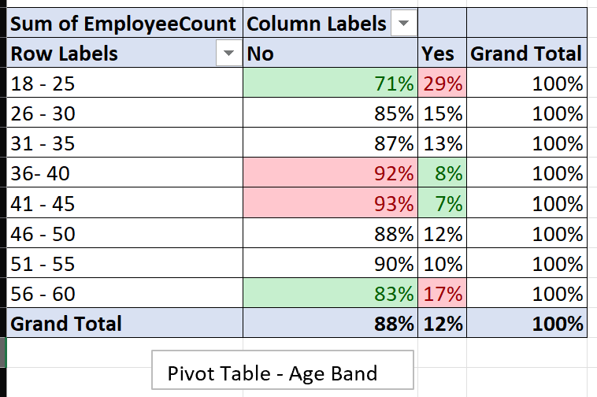
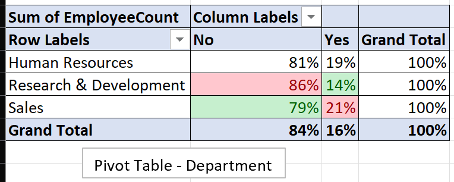
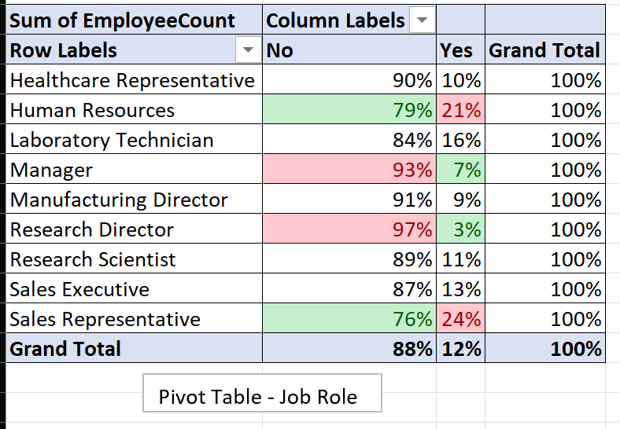
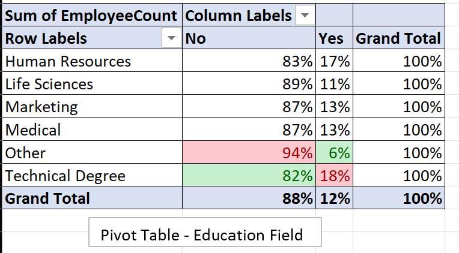

- **Step 8** : Apply **Conditional Formatting** (Top 10/25% → Red, Bottom 10/25% → Green).  
- **Step 9** : Add **Charts** (Line Chart, Clustered Column/Bar).

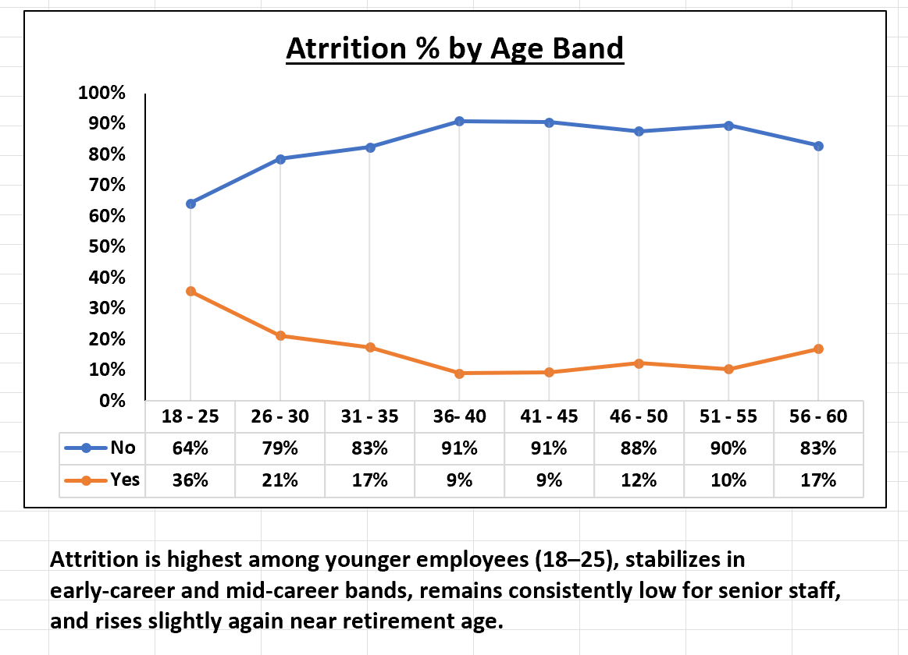
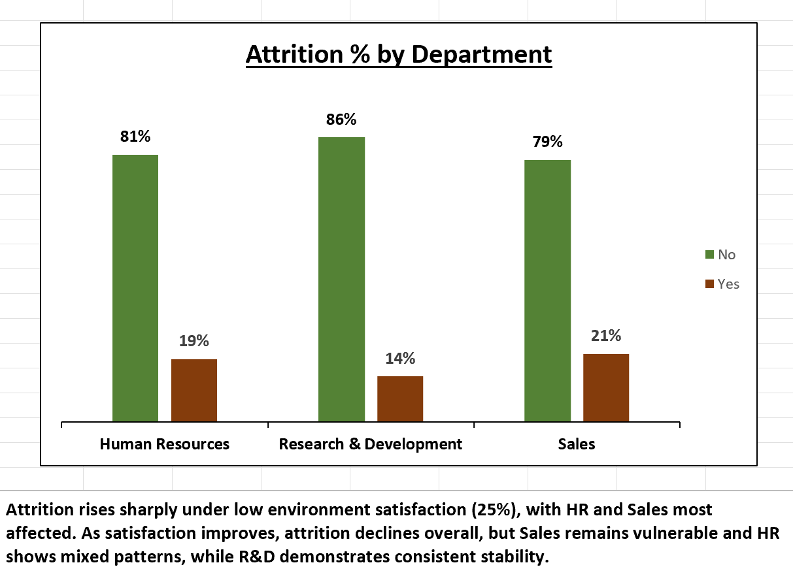
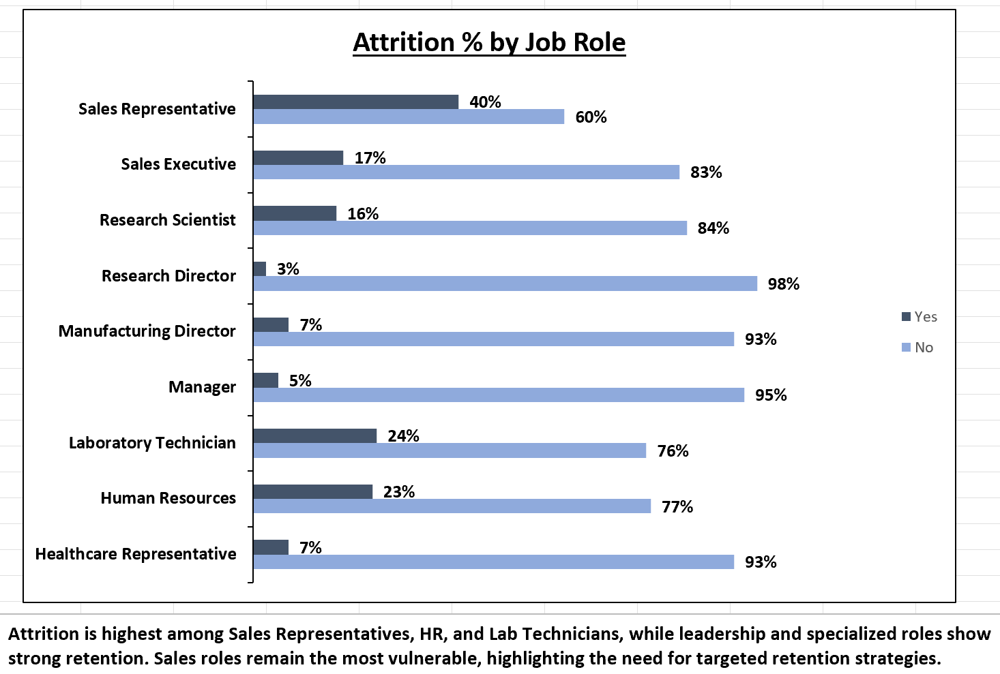
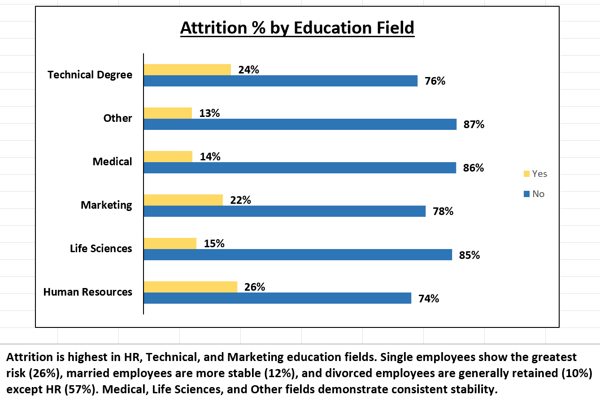


- **Step 10** : Add **Filters/Slicers** (Overtime, Environment Satisfaction, Gender, Marital Status).

### Dashboard Interactivity Example
**Without Slicer Applied (All Employees)**
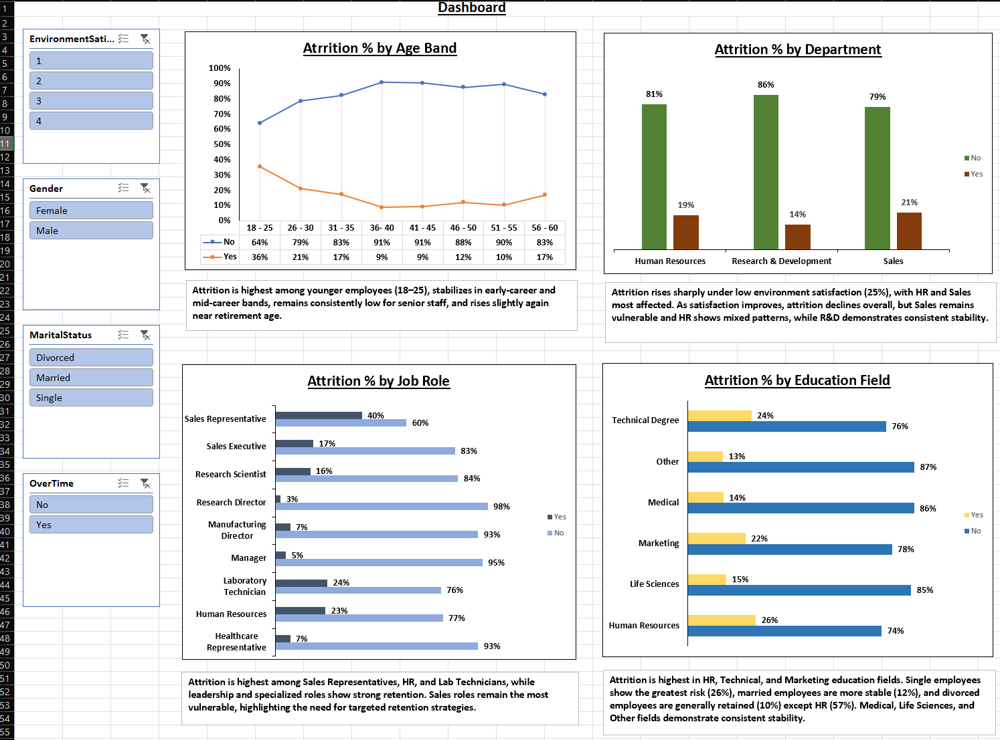

**With Overtime Slicer Applied**
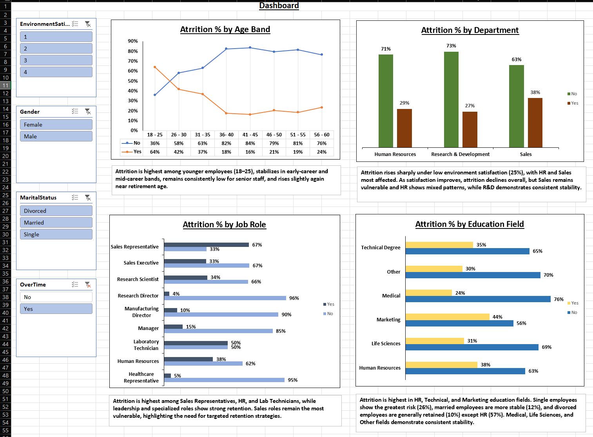


- **Step 11** : Add **Text Boxes** summarizing key insights below charts.  
- **Step 12** : Build final **Dashboard** combining all visuals.  

# Snapshot of Dashboard (Excel)

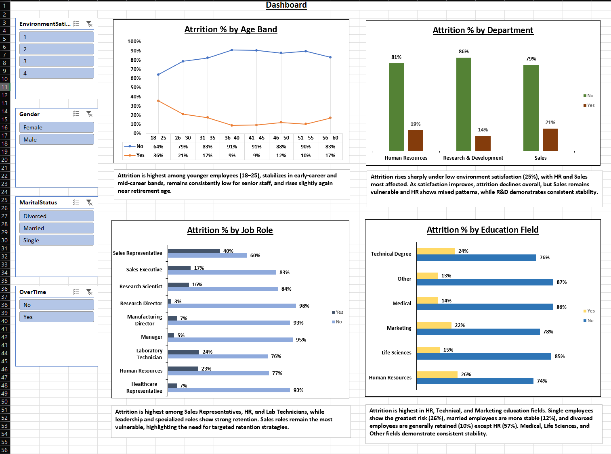

---

# Insights & Dashboard Storytelling Flow

A single page dashboard was created in Excel, combining multiple attrition perspectives.  
Following inferences can be drawn:

### [1] Attrition by Age Band (with Overtime Filter)
- Overall attrition = **16%**.  
- Young employees (18–25) → **36%** attrition (highest).  
- Attrition stabilizes in mid‑career (9–17%) and rises slightly near retirement (17%).  
**Story**: Younger employees are most vulnerable; mentorship and career growth programs are essential.

### Attrition by Age Band


**With Overtime Applied (Slicer = Yes):**
- Overall attrition rises from **16% → 31%**. 
- Young employees (18–25) → **64%** attrition under overtime.
**Story**: Overtime is the strongest predictor of early‑career attrition. Flexible schedules are critical.

### Attrition by Age Band (Slicer: Overtime = Yes)
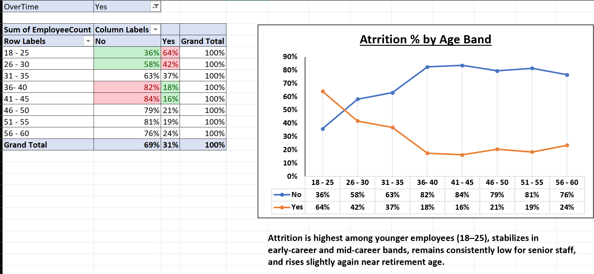
---

### [2] Attrition by Department (with Environment Satisfaction Filter)
- Sales → **21%** (highest).  
- HR → **19%** (moderate).  
- R&D → **14%** (lowest).  
- Environment satisfaction filter shows attrition spikes to **25%** at lowest satisfaction, especially HR (36%) and Sales (29%).  
**Story**: Satisfaction levels directly influence attrition. HR is highly sensitive, Sales persistently vulnerable, R&D stable.

### Attrition by Department (Slicer: Environment Satisfaction = 1 vs 3)
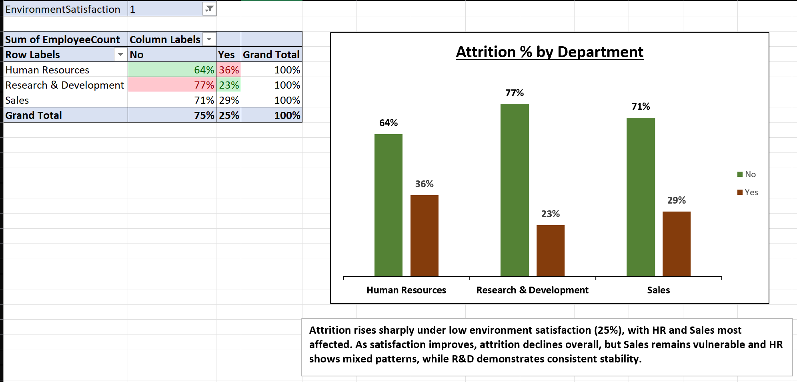
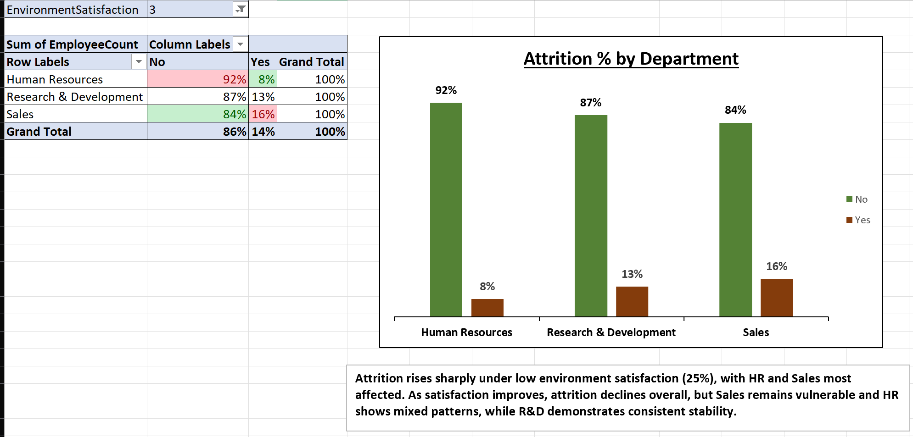

---

### [3] Attrition by Job Role (with Gender Filter)
- Sales Representatives → **40%** (highest).  
- Lab Technicians → **24%**, HR → **23%.**  
- Leadership roles (Managers, Directors) → **3–7%** (lowest).  
- Gender filter: Female HR attrition = **38%** vs Male HR = **17%.**  
**Story**: Attrition is role‑ and gender‑sensitive, with sales roles consistently vulnerable.

### Attrition by Job Role (Slicer: Gender = Male and Female)
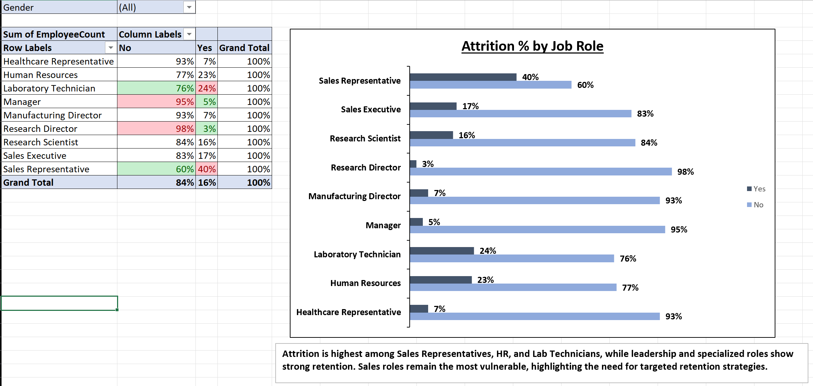
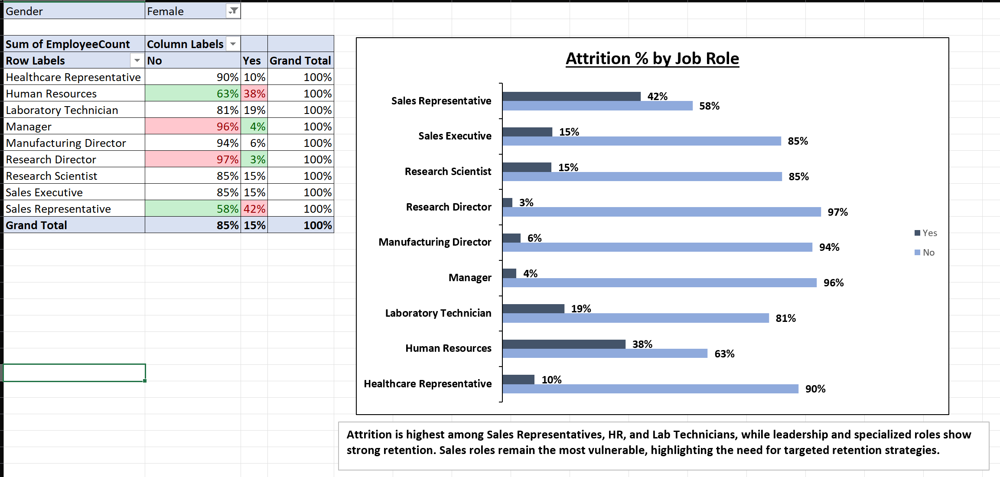

---

### [4] Attrition by Education Field & Marital Status
- HR (26%), Technical (24%), Marketing (22%) → highest risk fields.  
- **Single employees** → 26% attrition (Marketing & Technical = 42%).  
- **Married employees** → 12% attrition (more stable).  
- **Divorced employees** → 10% attrition overall, but HR anomaly = **57%.**  
**Story**: Attrition varies sharply by education and marital status. HR divorced employees face extreme risk.

### Attrition by Education Field (Slicer: Marital Status = Single, Married and Divorce)
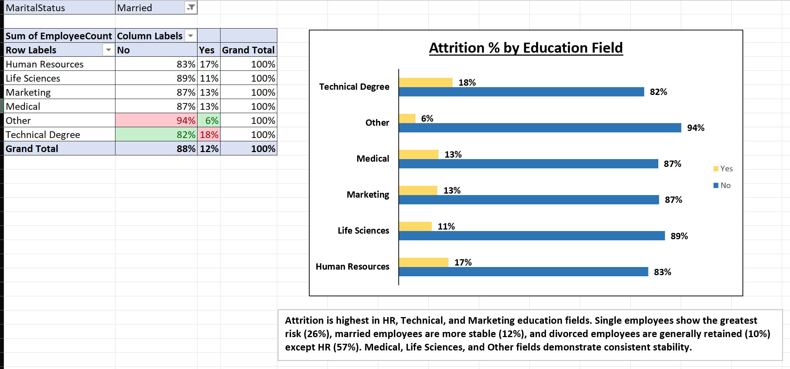

---

# Final Professional Summary
- **Baseline attrition = 16%.**  
- **Hotspots**: Young employees, overtime workers, Sales dept, Sales Representatives, HR, Technical, Marketing fields.  
- **Stable groups**: Mid‑career & senior employees, R&D, leadership roles, Medical & Life Sciences fields, married employees.  
- **Critical anomalies**: Overtime impact on young employees (64%), HR divorced employees (57%).  

---

# Business Insight Angle
- Focus retention strategies on **young employees** and **sales roles**.  
- Reduce **overtime pressure** for early‑career staff.  
- Improve **environment satisfaction**, especially in HR and Sales.  
- Tailor strategies by **education field & marital status** (flexible schedules for singles, support programs for HR divorced employees).  
- Leverage stability in **R&D, leadership, and specialized fields** as benchmarks for best practices.


## Conclusion
This project demonstrates how Excel + PQE + PivotTables can uncover HR attrition insights.  
It highlights vulnerable employee groups, identifies drivers of attrition, and provides actionable retention strategies. 
---
